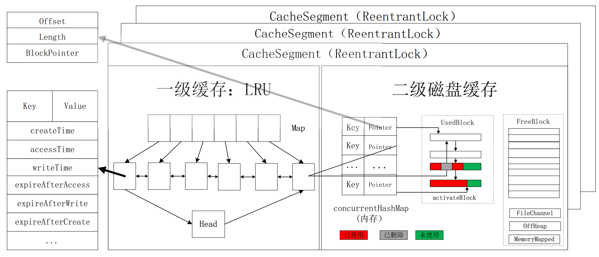

# JCache

**基础功能:**

一个高性能二级缓存实现，内存LRU/LFU缓存+磁盘文件持久化缓存。

* 支持过期（Expiration）清除;
* 支持LRU/LFU ~ 如果超过内存缓存容量，最近不常使用的项将被剔除（Eviction）;
* 支持剔除（Eviction）到二级可持久化缓存;
* 支持回写（WriteBehind）到后端持久化存储，例如DB。 `暂未实现`
* BigCache的Key常驻内存，Value可持久化
* BigCache支持存磁盘文件，内存映射+磁盘文件，和堆外内存+磁盘文件3种模式。

---

## 详细设计

**1. 整体结构图：**

### 一级缓存(内存LRU/LFU)设计思路

**分析**：首先，一级缓存主要就是一个LRU，而LRU的关键数据结构是一个Map以及一个双向链表，并不是特别复杂，但是要考虑到缓存还要支持过期处理以及性能监测，所以设计应该更全面，解耦合等。

1. **数据存在哪里？**
   一级缓存的数据是保存在双向链表中，更具体一点，每一个节点保存一个数据，这个节点即 `HashCacheEntry`，节点除了Key，Value外还包括缓存数据的创建时间 `createTime`，访问时间 `accessTime`以及写入/更新时间 `writeTime`，以及该缓存的过期时间 `expireAfterAccess、expireAfterWrite、expireAfterCreate`，因为是链表节点，所以应该包括 `prev、next`指针[^1]。由于高并发的情况下可能在同一时间对同一个缓存进行操作，所以对该缓存的所有访问都是通过 `UNSFAE`来更新，利用CAS机制来修改。此外，对于链表节点的数据的操作，通过接口进行提取得到 `CacheEntry`接口，包括对各种参数的设置以及最关键的读/写缓存。
2. **数据如何组织？**
   通过实现一个**双向链表**来组织数据。首先我们设计一个抽象类，让其实现Java提供的 `Deque`接口，该接口是一个双向链表的操作，包括头插、尾插，获取头部、尾部，获取大小，删除头节点等等操作，此外将用不到的函数直接抛异常，不让使用，最终得到 `AbstractDeque`。通过实现这个抽象类来实现LRU的双向队列 `SegmentAccessQueue`。这里值得注意的是，每个链表都有一个单例头节点，这里通过**静态内部类**的方式来保证单例。

### 二级缓存(磁盘文件持久化缓存)设计思路

**分析：** 二级缓存设计相对来说则比较复杂，首先，二级缓存设计到IO，需要将文件先读入内存，然后通过 `FileChannel`或 `MemoryMappedBuffer`来实现，或者通过 `OffHeapMemory`来实现。一共三种实现方式。二级缓存设计中，需要将Key保存到内存，然后Value则是一个指针，指向保存对象的Block、对象在Block的相对位置以及大小。通过这种方法来保存数据。同样面临如上的问题：

1. **数据存在哪里？**
   数据存放在 `StorageBlock`中，而StorageBlock又可分为三类：`OffHeapStorage、FileChannelStorage和MemoryMappedStorage`。每个Block包括该block的index，capacity以及指向具体Storage的指针。与一级缓存不同，一级缓存一个节点（CacheEntry）保存一个缓存数据，二级缓存一次申请一块（128MB），最多能保存1GB缓存内容。所以对每一个对象，需要保存起具体的位置信息。即 `Pointer`，Pointer保存了对象的偏移offset，大小Length以及对应的Block的位置。`Pointer`和 `Key`一起保存在内存中，用于定位缓存。
   还有一个值得关注的地方是**缓存申请/清除/替换**等操作。这里的操作包括通过Pointer检索，删除，更新。还有获取Block中的使用情况等的。Block中以及用于保存缓存的地方是 `used`，对于曾经保存过缓存但是过期删除的数据标记为 `deleted`，剩余没有使用的地方为 `free`。**缓存对象保存**：所有的block可以分为usedBlock和freeBlock，usedBlock中最新的一个标记为activateBlock，每次存放新缓存时先去activateBlock看是否能够寸的下，如果可以的话就保存，然后移动activateBlock的offset；如果存不下，则从freeBlock中申请新的Block作为新的activaeBlock加入到usedBlock数组中。**缓存对象更新**则是先找到原缓存所在的地方，比较新数据大小和旧数据大小，如果空间足够则直接替换，否则的话需要在activateBlock中保存，然后***删除***旧数据。注意这里的***删除***并不是真正意义上的删除，而只是标记为删除，由于offset只增不减，没法重新定位到***被删除***的空间，所以没有办法重新利用。随着时间推移，越来越多的缓存会过期或者被删除，所以这里需要对过期、删除的数据进行处理。通过设置一个ScheduledExecutorService(2)的线程池来对Block中的过期缓存进行 `Purge`以及当Block的dirtyRate大于一个阈值（0.5）时进行 `Merger`操作。同样，对于Block的操作提取出来作为一个接口 `IStorageBlock`。
2. **数据如何组织？**
   上面提到的是对同一个Block中数据的操作。二级缓存涉及到大量的Block，所以需要对这些Block进行管理：`StorageManager`。包括这些缓存文件存放位置，每个块的大小，以及访问时考虑到并发，所以需要加锁；通过 `concurrentLinkedDeque` 队列来保存 `usedBlock `，然后通过 `PriorityBlockingQueue `来保存所有freeBlock，每个block指定一个index，每次都选择index小的block来使用。这样可以优化文件访问，重复使用文件前面的block而不用读取文件靠后位置的block（减少磁盘操作：理论上）以及为了方便使用activateBlock指向 `usedBlock`最新的block。
   完成StorageManager后，将其与内存中保存的Key结合起来就可以。而这里的结合是通过 `concurrencyHashMap`来实现，其Key就是Key，Value则是Pointer。同时实现上述的两个定时任务即可。

### 埋点监控

对于一个能商用的缓存来说，对缓存中的各个部分的性能监控是非常有必要的。对于缓存这个场景，最重要的性能指标就是对各个缓存的查询次数、缓存的命中次数，Miss次数，其中命中和失效包括内存命中（一级缓存）和evict命中（二级缓存）以及behind命中（二级缓存，暂未实现）以及失效。还有缓存创建、更新、删除次数等。除了这些访问信息外，还应该包括缓存大小，内存大小等信息。本项目实现了较为全面的缓存状态监控，对每一个segment都维护了一个SegmentStatsCounter，然后通过对所有segment求和得到cache整体的缓存监控。对于独立的二级缓存来说，还单独提供了一个BigCacheStats来记录缓存的使用情况，包括正常的命中和miss次数外，还包括used空间的大小，dirty空间的大小，，UsedBlock的数量，FreeBlock数量以及总共Block的数量。

### 整体思路

一级缓存、二级缓存本身可以独立成一个部分，除此之外支持WriteBehind的 `BehindStore`（暂未实现）三部分组成整体缓存架构的一个 `CacheSegment`。**CacheSegment查询**时会首先查询一级缓存，如果发现查找的缓存已经过期则直接将其从accessQueue中删除，然后更新统计信息**，否则的话说明找到了，然后获取数据，根据配置是否更新缓存的访问时间，然后将其保存在队列尾部（LRU）；如果一级缓存没找到的话，会从二级缓存中（concurrencyHashMap）中找，尝试将其从store中remove，同时获取，如果获取失败则失败，如果获取成功，返回该对象（CacheEntry，二级缓存中的数据也是CacheEntry序列化后的byte数组），获取CacheEntry对象后获取其值，然后将其保存在队尾，更新访问时间和其他时间，然后将其保存在内存CacheEntry数组中。CacheSegment的其他炒作顺序也是类似，先去一级缓存查找，找不到再到二级缓存查找。

为了提升缓存性能，最终cache在实现的时候生成了一个CacheSegment数组，所有**缓存数组是公用二级缓存（evictStores和writeBehindStores）的**，每个cacheSegment实现一个一级缓存，然后在访问的过程中，会先进行一次Segment分区，通过key的hashCode的固定操作再取余得到对应的segment，然后在去对应segment查找。查找过程与上述一致。

### 其他

---

> 核心内容参考自：archbobo老师的okcache.

[^1]: 两种指针，Access是链表指针。
